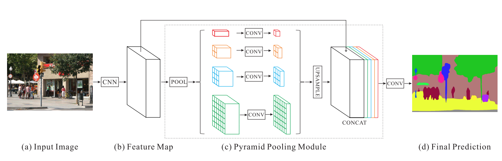
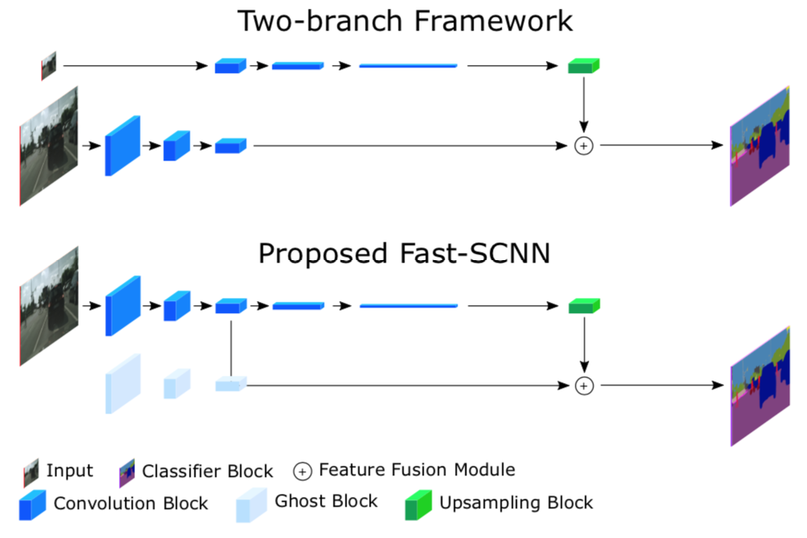

# fast_scnn
fast_scnn object detection

https://arxiv.org/abs/1902.04502

Fast-SCNN is constructed using 4 major building blocks.

Learning to Down-sample
Global Feature Extractor
Feature Fusion
Classifier

Bottleneck residual block

Feature Fusion

Validation results from fast_scnn, compared with input image and ground truth

